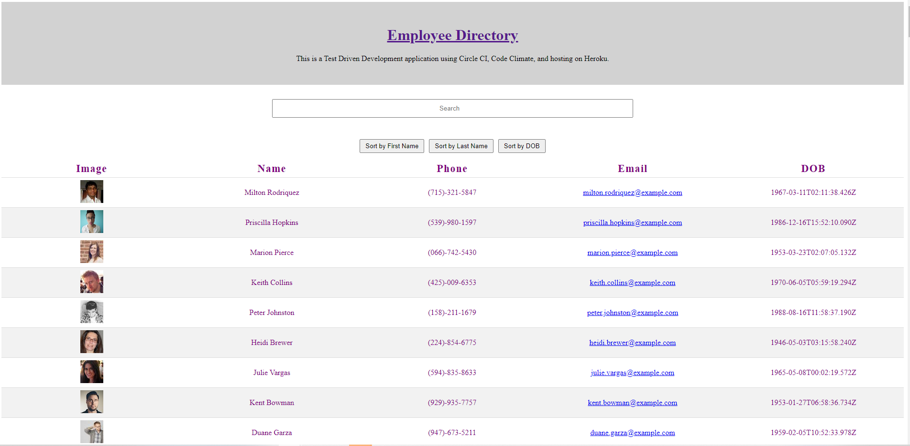

# Unit 19 React Homework: Employee Directory - Test Driven Development

# Links
* Heroku:  (https://hw19employee-directory.herokuapp.com/)
* GitHub:  (https://github.com/dianecandler/hw19employee-directory)

## Overview

Created a employee directory with React. This assignment will require you to break up your application's UI into components, manage component state, and respond to user events.

# Image

## User Story

* As a user, I want to be able to view my entire employee directory at once so that I have quick access to their information.

## Business Context

An employee or manager would benefit greatly from being able to view non-sensitive data about other employees. It would be particularly helpful to be able to filter employees by name.

This project was bootstrapped with [Create React App](https://github.com/facebook/create-react-app).

### `npm start`

Runs the app in the development mode. 
Open [http://localhost:3000](http://localhost:3000) to view it in the browser.

The page will reload if you make edits. 
You will also see any lint errors in the console.

# Thank you

***Your time is valuable. Thank you for taking time to review this program. Feedback is welcome at dianedcandler@gmail.com.***

## Visit my Portfolio

https://dianecandler.herokuapp.com/