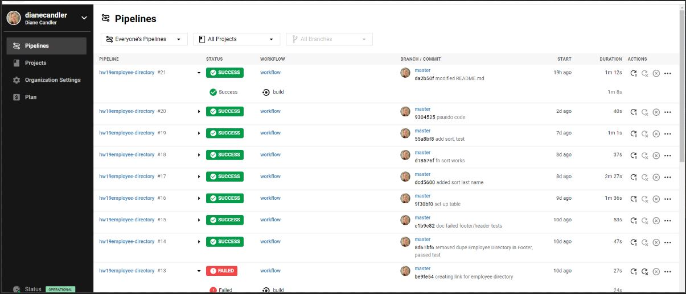

# Employee Directory - React with Test Driven Development

# Links
* Heroku:  (https://hw19employee-directory.herokuapp.com/)
* GitHub:  (https://github.com/dianecandler/hw19employee-directory)

## Overview

* Created a employee directory with React. 
* Found React ideally suited as wanted to divide application's UI into components, manage component state, and respond to user events.
* Added filters to allow data sorting by name and data of birth. (see file named `Table.jsx`)
* Data is provided in the data.json file.

# Sneak peek at the application!

## Test Driven Design 

:traffic_light: To start test:  `npm run test`
* Found Ken C. Dodds materials helpful.
* Pipelines readout from Circle CI below.

## User Story

* As a user, I want to be able to view my entire employee directory at once so that I have quick access to their information.

## Business Context

An employee or manager would benefit greatly from being able to view non-sensitive data about other employees. It would be particularly helpful to be able to filter employees by name.

This project was bootstrapped with [Create React App](https://github.com/facebook/create-react-app).

### `npm start`

Runs the application.
Open [http://localhost:3000](http://localhost:3000) to view it in the browser.

# Thank you

***Your time is valuable. Thank you for taking time to review this program. Feedback is welcome at dianedcandler@gmail.com.***

## Visit my Portfolio

https://dianecandler.herokuapp.com/
